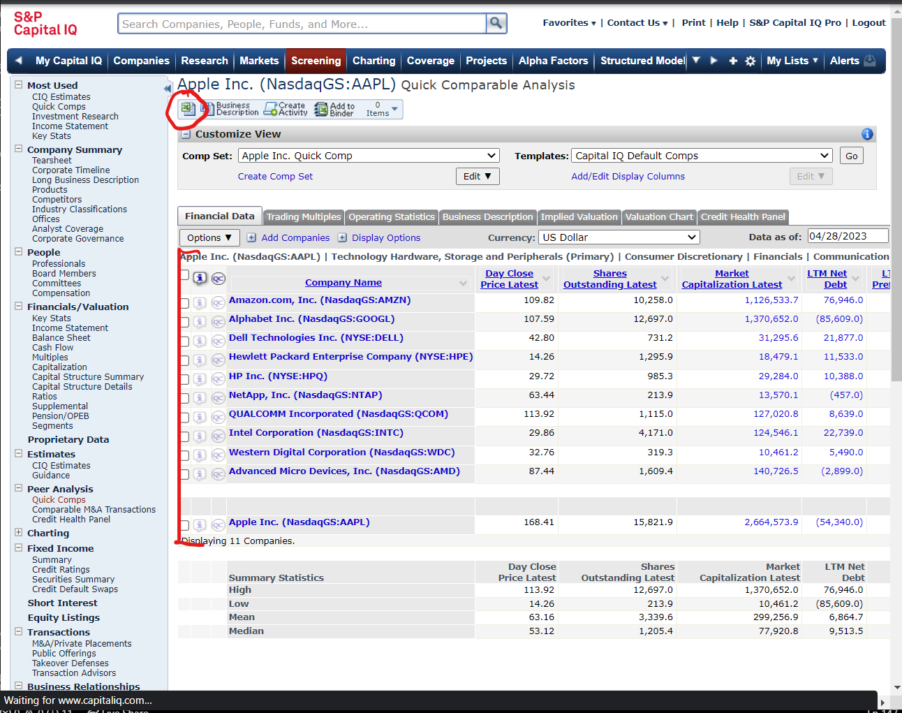
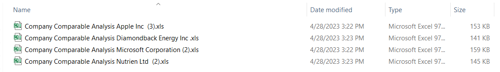
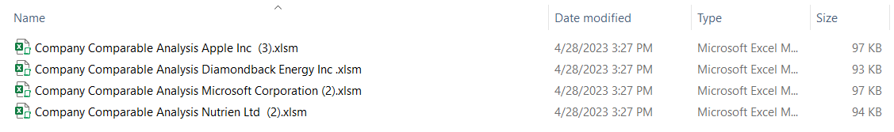
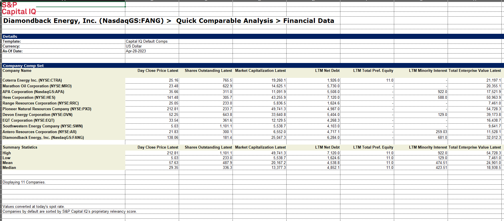
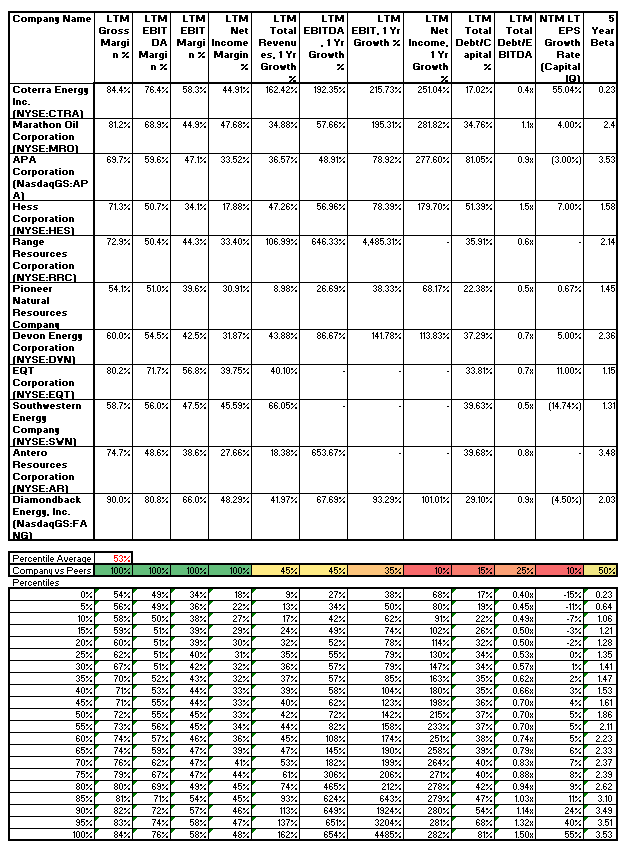
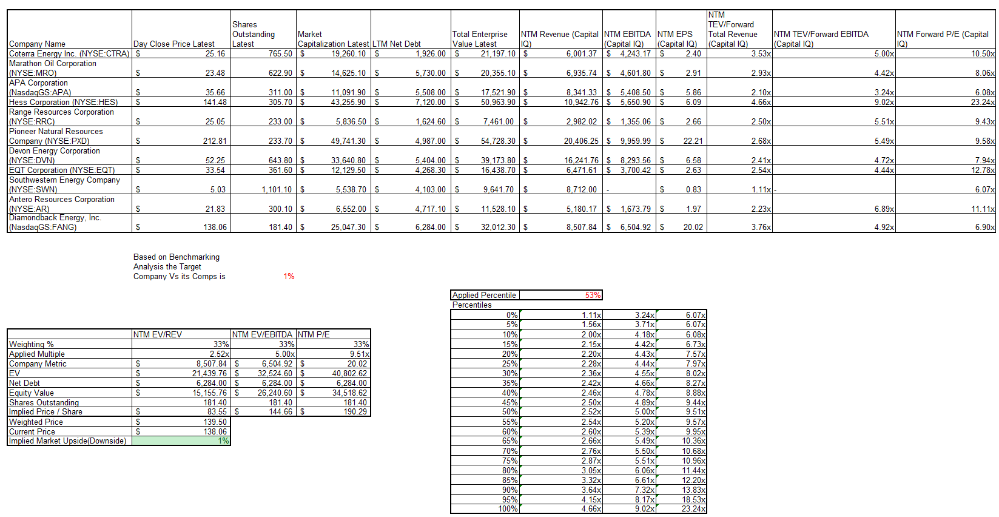

# Team-Project: Automating Comparable Company Analysis with Selenium and Excel

Team members: Naomi Wilson, Sergio Avila.

Code is designed to automate Comparable Company Analysis using Python, Excel, and CapitalIQ - as such it is tailored for Babson students - but it could also work for anyone with CapitalIQ credentials (after some modifications). 

### Objective
The main idea of our project is to automate Financial Comparable Analysis for any industry (publicly-traded) given a series of names or tickers. Our program would analyze and benchmark on various metrics, then use the weighted average of percentile to perform an analysis of the target company versus a group of competitors to determine which ones are under/overvalued relative to how they rank. Project topics include API, Excel Manipulation, Automation, Software Design, and Financial Analysis. Our project runs in two main functions. One utilizes the selenium library to use user credentials to sign into CapitalIQ and download comparable company data. This has several advantages - it has analyst comparables, forward estimates for metrics and multiples, and allows for excel automation which the team wanted to experience given its real world applications for job settings. The other functionality uses os, wlwings, and aspose libraries to convert the excel files into a usable form and then perform a series of analysis on them. The function also injects and calls VBA code that natively takes care of user friendly formatting. 


## Instructions

    1. Download required libraries to use selenium, aspose, glob, shutil, time, os, and xlwings.
    2. In Excel settings, enable VBA macros and trust access to the VBA project object model.
    3. Fork repository to local computer and ensure folder path is correctly formatted.
    4. Run Final_Production.py - Enter Babson Email and Password and List of Companies to Analyze.
    5. Wait for code to run - You will be prompted when it is done. The analysis will have been added
    to each Excel sheet.
    6. Move these Excel sheets to another local folder before running code again.
    7. Make individual edits to each Excel as need.
   
    #This is a starting analysis and not fully comprehensive company valuation.


## Screenshots














## Download and Installation

Below are the required libraries to install to run code. Code runs on python - please download latest version:

```bash
  Install Python - https://www.python.org/downloads/
  pip install selenium
  pip install aspose-cells-python
  pip install glob2
  pip install xlwings
```

## Documentation

[selenium](https://selenium-python.readthedocs.io/)

[xlwings](https://docs.xlwings.org/en/latest/)

[glob2](https://pypi.org/project/glob2/0.4.1/)


## Third Party Sources

    [Selenium]
        https://www.tutorialspoint.com/how-to-open-browser-window-in-incognito-private-mode-using-python-selenium-webdriver
        https://www.thepythoncode.com/article/automate-login-to-websites-using-selenium-in-python 
        https://www.geeksforgeeks.org/find_element_by_id-driver-method-selenium-python/ 
        https://pythonbasics.org/selenium-keyboard/ 
        https://selenium-python.readthedocs.io/locating-elements.html  
    
    [Moving Files Locally]
        https://www.learndatasci.com/solutions/python-move-file/
        https://datatofish.com/latest-file-python/ 

    [XLWING]
        https://www.geeksforgeeks.org/working-with-excel-files-in-python-using-xlwings/
        https://docs.xlwings.org/en/stable/quickstart.html#macros-call-python-from-excel
        http://www.et.byu.edu/~treedoug/_pages/teaching/ChEn263/Lectures/Lec23-XLWings_handout.pdf
        https://www.dataquest.io/blog/python-excel-xlwings-tutorial/

    [ASPOSE]
        https://products.aspose.com/cells/python-net/conversion/xls-to-xlsm/

    *ChatGPT aided in the debugging process


